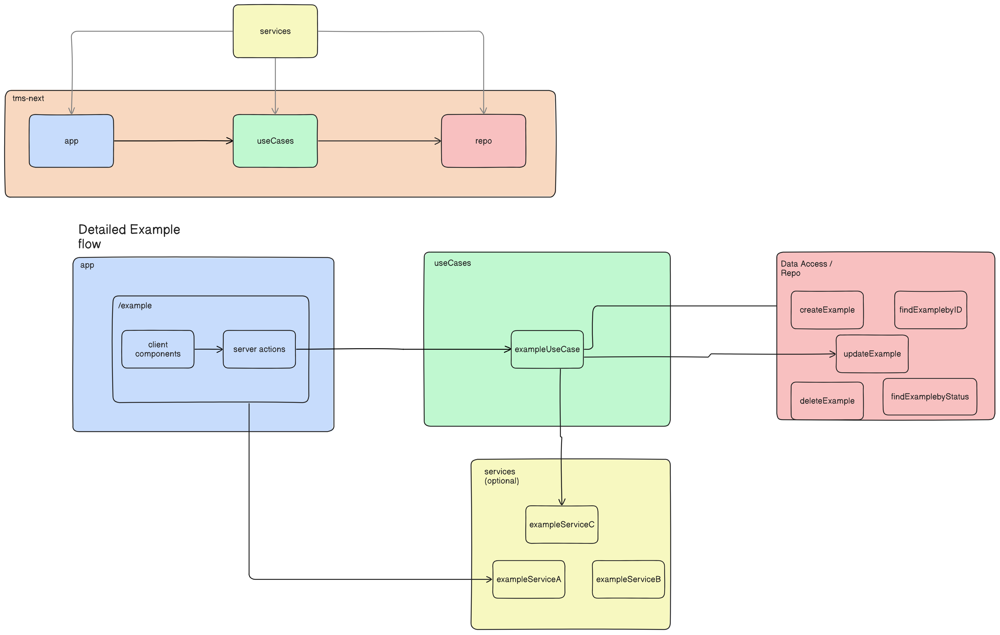
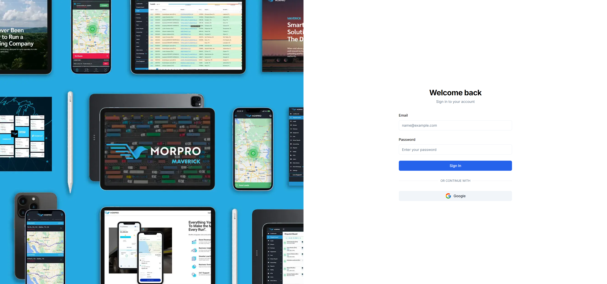
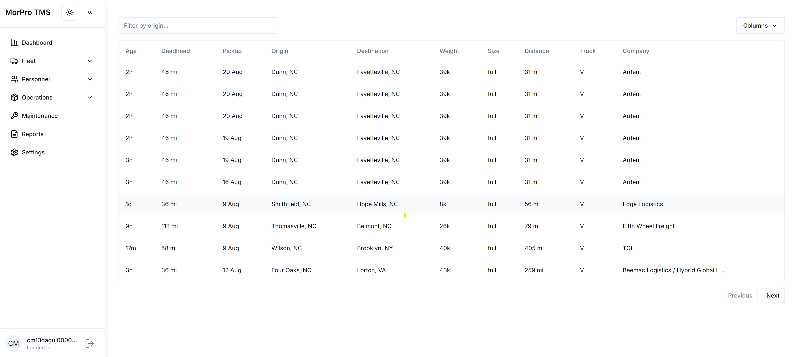
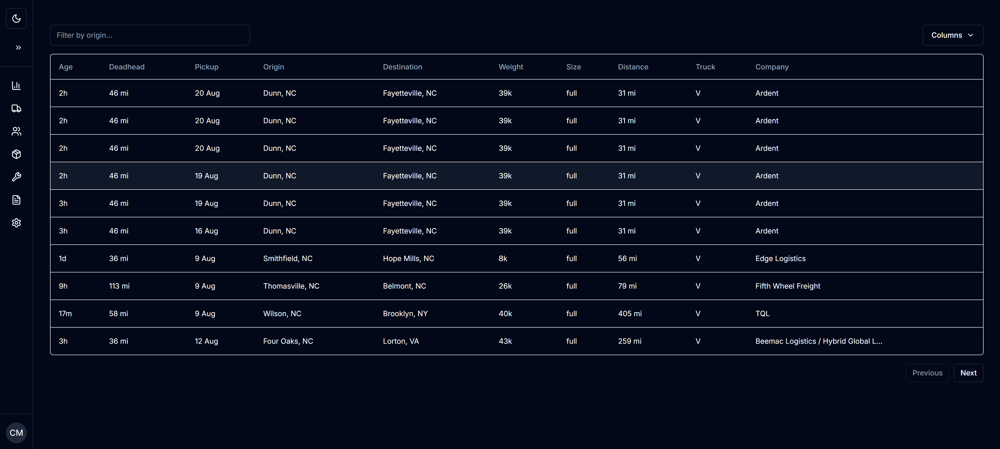
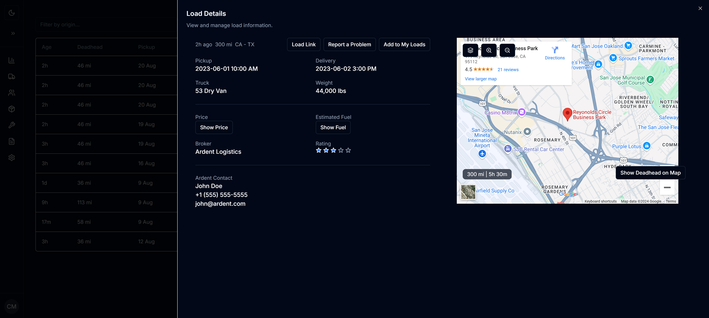

# TMS
This is a trucking management system template with a simple UI and authentication.

## Tech Stack
- [Next.js](https://nextjs.org/docs) - Fullstack framework for React. Used with App Router.
- [Prisma](https://www.prisma.io/) with SQLite for database, there is dockerfile for postgresql.
- [Lucia](https://lucia-auth.com/getting-started/) for authentication. 
- [TailwindCSS](https://tailwindcss.com/) and [Shadcn](https://ui.shadcn.com/) for styling and UI components.
- [ZSA](https://zsa.vercel.app/docs/introduction) for type safe server actions.
- [Zod](https://zod.dev/) for type safe validation.

## How to run
Run the following commands on your terminal: 
`cd tms-next`
 
`npm install`
 
`npm run dev`

You will need to create a .env file with the following variables:
- GOOGLE_CLIENT_ID = ''
- GOOGLE_CLIENT_SECRET= ''
- HOST_NAME=http://localhost:3000

Also you will need renamed the middleware.ts file to make the routes protected. It is disabled by default to allow you to test the app without authentication. Explore pages /signin /loadboard and /signout to see how it works. The home page "/" is never accessed after the middleware.ts is enabled.

## Software architecture  

The app is divided/abstarcted into 4 main parts:
- App - this contains all Next and frontend/UI logic. Associated directories are in the app folder and the components. It should be noted that the components only store global UI components. Components used only in its respective routes are kept in the same folders.
- UseCases - this implements all the business logic and communicates with data in the repo layer. The associated directory is the useCases folder.
- Repo - this is the data layer, it contains all the data access logic and communicates with the database. The associated directory is the repo folder.
- Services - this is the service layer, it contains all 3rd party dependencies that are used by the app and useCases layer. The associated directory is the services folder.

Creating this abstraction allows for a clean separation of concerns and makes it easier to maintain and/or replace parts of the app without affecting the code at multiple places. This ultimately allows to scale the app. 

## Screenshots

Following screenshots are with dark mode enabled :

